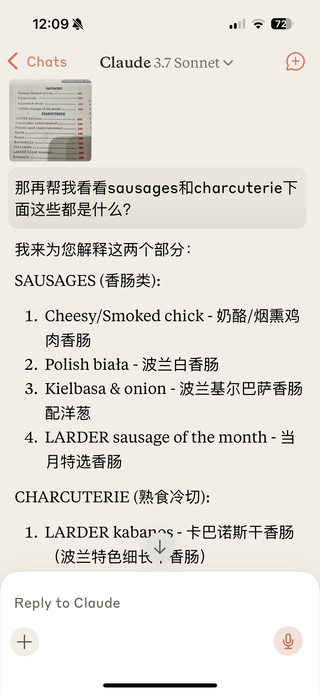

# 缘起

事情的发生总是需要一些契机来推动。

第一个契机是：在过去一年里，我逐渐把claude培养成生活助手，从各种小知识问答到运动健身数据分析，都会随时用到。其中最让我觉得无可替代的能力就是拍照翻译。举一个春节的例子:

我相信绝大部分人（不论中国外国）看到这个菜单都会一脸懵逼不知道写得是什么，而且你也很难保证能和当地店员交流。但AI能给你提供方便的信息，不需要挨个去查。

在那时候我想过做一个基于SwiftUI的iOS App，就用来拍照识别菜单，我可以提前告诉AI我有些什么忌口或者不吃辣之类的，在旅途中减少很多麻烦。当时随手让claude帮我做了个原型，但想到这玩意儿如果还需要部署服务，加用户认证登录，加上各种API防破解等等就顿时没了兴趣继续。

第二个契机是2025年春节DeepSeek R1刷屏，我其实没特别在意它的云端服务，但可以私有化部署如此强大的模型（哪怕是缩水量化后的）实在令人心动。

下一个契机则是国补的Mac mini M4，我需要给自己找借口花钱买新机器，于是找到了这么几个借口：

- 可以当家用媒体中心，下载电影，连电视看
- 挂上大硬盘给手机备份
- 可以在家部署大模型，在家里跟R1聊天
- 用大模型帮忙做专利文献翻译，节省工作时间，提升生活幸福指数

于是，在这三个契机的推动下，我终于一咬牙一跺脚买了一台新的mac mini M4，16G内存，另外买了一块2T的SSD当外接硬盘。
