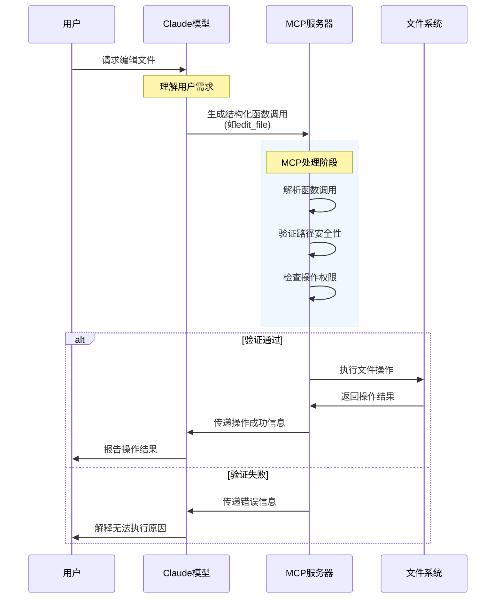

# Claude和MCP

这里还是多说一嘴MCP是个啥，毕竟不是每个人都在用。

MCP = Model Context Protocol，模型上下文协议。这个解释跟没说一样。我们可以稍微具象化一下这个概念。

大概是从去年开始，有个特别火的概念叫Agentic AI，就是让AI自己干活。

如果拿现实工作举例子的话，chatbot如果做牛逼了，大概就是厂里的ppt大拿，上可以向领导汇报，下可以PUA小弟，唯一不能干的事儿就是写代码。Agentic的意思就是chatbot可以亲身干活了，约等于一个大拿加几个小弟，写代码编译调试部署都可以亲自完成（就像现在最火的manus）。那么MCP是干啥的呢？大拿写代码也得有文本编辑器，大拿部署代码也得有terminal工具或者浏览器来点点点，MCP现在就相当于这个文本编辑器、terminal工具和浏览器。

以文本编辑为例，MCP会定义一组文件操作的函数，比如read_file, write_file, edit_file，这些基本就跟传统函数一样，有参数规范也有执行权限。当claude需要编辑文件时，它会向MCP server发起指令，MCP server处理指令并且执行动作，最后返回结果，可以参考下面这张流程图。

一句话总结：claude现在可以自动编辑我的本地文件，再也不需要我跟他聊过后把结果拷贝下来了。