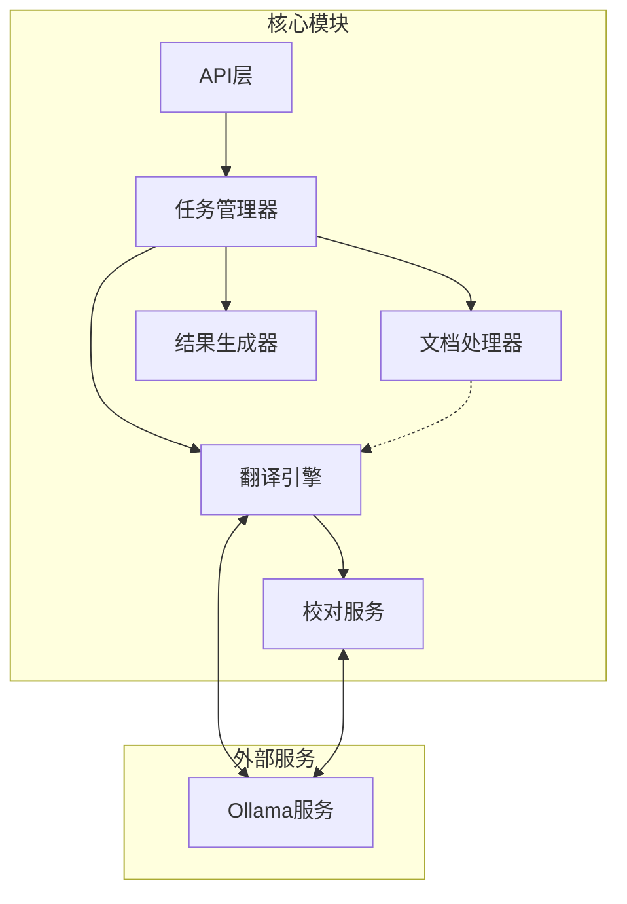
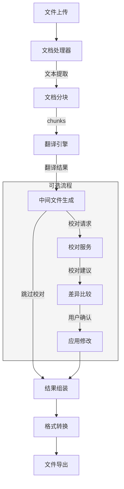

# 后端架构设计

*本文档描述专利文档翻译系统的后端架构设计。*

## 目的与范围

本文档旨在详细说明专利文档翻译系统的后端架构设计，包括技术栈选择、核心模块、数据流程、并发处理策略等。此文档面向开发团队、系统架构师以及项目利益相关者，作为系统实现和后续维护的指导依据。

主要内容包括：
- 系统后端的整体架构设计
- 核心组件的功能定义与交互关系
- 技术选型及理由
- 数据流转与处理逻辑
- 系统的扩展性、安全性考虑

## 架构原则

1. **离线优先** - 系统设计确保所有处理可在无互联网环境下进行，保障数据安全性
2. **模块化设计** - 采用高内聚、低耦合的模块化架构，便于扩展和维护
3. **资源效率** - 优化系统资源使用，考虑Mac Mini的硬件限制
4. **可靠性优先** - 确保翻译过程的可靠性，提供错误恢复机制
5. **渐进式处理** - 支持大文档的分块处理，避免内存溢出
6. **一致性保障** - 确保专业术语翻译的一致性和精确性
7. **可追溯性** - 保留翻译过程的中间数据，支持问题排查和质量改进

## 技术栈

### 编程语言与核心框架
- **编程语言**: Python 3.10+
- **Web框架**: FastAPI
  - 提供高性能的异步API
  - 内置OpenAPI文档生成
  - 类型安全的请求/响应校验
- **ASGI服务器**: Uvicorn
  - 处理异步HTTP请求
  - 支持WebSocket通信（用于实时进度更新）

### 任务处理
- **任务队列**: Celery
  - 管理长时间运行的翻译任务
  - 支持任务优先级和重试机制
- **消息中间件**: Redis/RabbitMQ (可选配置)
  - 当处理大量任务时提供更可靠的消息队列

### 数据持久化
- **数据库**: SQLite
  - 轻量级、无需额外服务器
  - 足够满足单机部署需求
  - 存储任务状态、文档元数据等
- **文件存储**: 本地文件系统
  - 存储原始文档、中间文件和翻译结果

### 大语言模型集成
- **模型服务**: Ollama
  - 本地部署的LLM服务
  - 当前使用模型: deepseek-r1:14b, deepseek-r1:8b
- **模型交互**: LangChain/LangChain-community
  - 提供与LLM的标准化交互接口
  - 管理提示词模板和上下文

### 文档处理
- **Word文档**: python-docx, docx2txt
- **PDF文档**: PyPDF2, pdf2text
- **Markdown处理**: markdown, pypandoc
- **格式转换**: pypandoc

### 开发工具
- **代码质量**: black, flake8, mypy
- **测试框架**: pytest
- **CI/CD**: GitHub Actions with self-hosted runner

## 核心模块

### 1. API层

负责处理HTTP请求/响应，为前端提供接口。

**主要职责**:
- 文件上传/下载接口
- 翻译任务提交与状态查询
- 校对请求处理
- WebSocket连接管理（用于实时进度更新）
- 输入验证和错误处理

**关键组件**:
- `APIRouter` - 按功能划分的路由集合
- `Schemas` - 请求/响应数据模型
- `Dependencies` - 共享依赖和中间件

### 2. 任务管理器

负责任务的创建、调度、状态跟踪和资源分配。

**主要职责**:
- 创建并排队翻译/校对任务
- 监控任务执行状态
- 管理任务优先级
- 处理任务失败和重试逻辑
- 资源使用限制与负载平衡

**关键组件**:
- `TaskService` - 任务CRUD操作
- `TaskQueue` - 基于Celery的队列管理
- `TaskMonitor` - 状态监控和通知

### 3. 文档处理器

负责文档的解析、转换和分段。

**主要职责**:
- 文件格式检测与验证
- 文本提取与规范化
- 文档分块处理
- 格式保持和结构分析
- 中间文件生成

**关键组件**:
- `DocumentParser` - 文档解析器（支持多种格式）
- `ChunkManager` - 文档分块策略
- `FormatConverter` - 格式转换服务
- `IntermediateFileGenerator` - 中间文件生成

### 4. 翻译引擎

负责与LLM交互，执行文本翻译。

**主要职责**:
- 提示词管理与优化
- LLM调用与响应处理
- 上下文管理
- 专业术语处理
- 翻译质量控制

**关键组件**:
- `TranslationService` - 翻译核心服务
- `PromptManager` - 提示词配置和模板
- `LLMClient` - 与Ollama的交互接口
- `TerminologyManager` - 术语库管理

### 5. 校对服务

负责翻译结果的审校和优化。

**主要职责**:
- 翻译结果评估
- 校对建议生成
- 差异比较和展示
- 修改原因说明
- 最终翻译质量保证

**关键组件**:
- `ReviewService` - 校对核心服务
- `DiffGenerator` - 差异比较工具
- `ReviewParser` - 校对报告解析器
- `DiffHtmlGenerator` - HTML报告生成器

### 6. 结果生成器

负责处理最终输出文档。

**主要职责**:
- 合并翻译的文本块
- 恢复文档格式和结构
- 生成多种格式的输出文件
- 批量处理多文档输出

**关键组件**:
- `ResultAssembler` - 结果组装服务
- `FormatRenderer` - 输出格式渲染
- `DocumentExporter` - 文档导出服务

## 数据流转与处理流程

### 主要流程说明

1. **文档上传与解析**
   - 文件通过API上传到系统
   - 验证文件格式和大小
   - 根据文件类型选择合适的解析器提取文本

2. **文档分块**
   - 根据配置的chunk大小将文档分为多个块
   - 考虑段落边界和语义完整性
   - 生成每个块的元数据（ID、位置等）

3. **翻译处理**
   - 为每个块准备带上下文的提示词
   - 调用LLM API执行翻译
   - 监控翻译进度和质量
   - 处理翻译中的错误和重试

4. **中间文件生成**
   - 创建包含源文本和译文对应关系的中间文件
   - 使用标准化格式存储块ID和翻译元数据
   - 保存用于追踪和调试的上下文信息

5. **校对流程（可选）**
   - 基于中间文件进行校对
   - 生成校对建议和修改说明
   - 创建直观的差异比较报告
   - 允许用户逐条确认或拒绝修改

6. **结果生成**
   - 合并所有已翻译和校对的块
   - 恢复原始文档的格式和结构
   - 根据需要转换为目标格式（Markdown/Word）
   - 提供下载或保存到指定位置

## 并发/异步处理策略

系统采用以下策略处理并发和异步任务：

### 任务并行化

1. **块级并行**
   - 文档被分割成独立的块，可并行翻译
   - 每个块作为单独的Celery任务处理
   - 块大小可配置，以平衡性能和质量

2. **资源限制**
   - 设置并发任务上限，避免系统过载
   - 基于Mac Mini的CPU核心和内存配置自动调整
   - 提供优先级队列，重要任务优先处理

### 状态管理与通知

1. **实时状态更新**
   - 使用WebSocket提供翻译进度的实时更新
   - 定期将任务状态持久化到数据库
   - 提供任务查询API获取当前状态

2. **异步回调**
   - 任务完成后触发回调函数
   - 支持链式任务执行（翻译完成后自动开始校对）
   - 错误发生时通知用户并提供恢复选项

### 任务控制

1. **暂停与恢复**
   - 支持长时间任务的暂停和恢复
   - 保存中间状态到持久化存储
   - 系统重启后能够恢复未完成的任务

2. **错误处理与重试**
   - 自动重试失败的任务（最大重试次数可配置）
   - 智能退避策略，避免重复失败
   - 详细记录错误原因，便于调试

## 资源管理

系统针对Mac Mini (M4+16GB)的硬件配置进行了优化：

### 内存管理

1. **分块处理策略**
   - 避免一次性加载整个文档到内存
   - 翻译完成的块及时释放内存
   - 大型文档自动调整块大小，确保内存使用在安全范围

2. **缓存策略**
   - 使用LRU缓存存储常用数据（如术语库）
   - 定期清理不需要的中间文件
   - 配置Ollama共享内存限制

### CPU利用率

1. **动态并发控制**
   - 监控CPU使用率，动态调整并发任务数
   - 高负载时自动降低并发度
   - 预留核心给系统和UI响应

2. **批处理优化**
   - 合并小任务减少调度开销
   - 优化LLM调用频率，减少上下文切换
   - 非关键任务安排在系统低负载时执行

### 磁盘空间

1. **临时文件管理**
   - 所有临时文件存储在可配置的工作目录
   - 定期清理过期的临时文件
   - 使用FIFO策略管理中间文件，保留最近的N个文件

2. **日志管理**
   - 实施日志轮转策略
   - 可配置的日志详细级别
   - 重要日志单独存储，便于问题排查

## 错误处理与恢复机制

系统提供了多层次的错误处理和恢复机制：

### 错误分类与处理

1. **预期错误**
   - 文件格式不支持 - 提供明确错误消息和支持的格式列表
   - 文件过大 - 建议分割文件或调整配置
   - LLM响应超时 - 自动重试或调整块大小

2. **非预期错误**
   - 系统异常 - 记录详细日志，提供问题报告功能
   - 模型错误 - 尝试备用模型或降级处理
   - 硬件资源不足 - 暂停任务并通知用户

### 恢复策略

1. **任务级恢复**
   - 从最后成功的块继续处理
   - 保留已完成的翻译结果
   - 提供手动编辑选项修复问题块

2. **系统级恢复**
   - 定期保存系统状态到持久化存储
   - 系统重启后自动恢复任务队列
   - 服务组件独立重启不影响整体系统

3. **数据保护**
   - 所有关键操作前自动备份原始数据
   - 不可恢复错误时提供回滚选项
   - 定期快照重要配置和数据

## 关键决策与权衡考虑

### 1. 本地LLM vs 云服务

**决策**：使用本地部署的LLM（通过Ollama）

**理由**：
- 满足离线处理的安全需求
- 避免专利文档发送到外部服务器
- 降低长期运营成本

**权衡**：
- 翻译质量可能不及大型云服务模型
- 本地部署增加了硬件要求
- 需要自行管理模型更新

### 2. 技术栈选择

**决策**：使用Python/FastAPI/Celery/SQLite技术栈

**理由**：
- Python生态系统丰富的NLP和文档处理库
- FastAPI提供高性能的异步API处理
- Celery成熟的任务队列管理
- SQLite轻量级、无需额外服务器

**权衡**：
- Python的并发性能不及Go或Rust
- SQLite在高并发场景下可能成为瓶颈
- 依赖管理复杂度增加

### 3. 翻译与校对策略

**决策**：实现两阶段处理 - 翻译+校对

**理由**：
- 提高翻译质量和准确性
- 允许用户参与决策过程
- 专门优化校对提示词

**权衡**：
- 增加了处理时间和资源消耗
- 用户交互更复杂
- 需要额外的差异比较功能

### 4. 分块策略

**决策**：实现基于中间文件的Chunk对齐方案

**理由**：
- 解决不同语言文本长度差异问题
- 提高翻译和校对过程的准确性
- 增强可追溯性和调试能力

**权衡**：
- 增加了存储需求
- 实现复杂度提高
- 需要处理文件间的依赖关系

## 风险与缓解策略

### 1. 性能风险

**风险**：大文档处理导致系统资源耗尽

**缓解策略**：
- 实施自适应分块策略
- 设置并发任务上限
- 监控资源使用并及时预警
- 提供任务优先级管理

### 2. 翻译质量风险

**风险**：本地LLM翻译质量不满足专业需求

**缓解策略**：
- 提示词持续优化
- 实施专业术语库
- 校对机制提升质量
- 允许用户手动编辑

### 3. 系统稳定性风险

**风险**：长时间运行导致系统不稳定

**缓解策略**：
- 定期自动重启服务组件
- 实施健康检查和故障恢复
- 资源使用预警和自动干预
- 定期维护清理临时文件

### 4. 数据安全风险

**风险**：敏感专利数据泄露或丢失

**缓解策略**：
- 严格的本地处理流程
- 临时文件加密和安全删除
- 定期数据备份
- 访问控制和审计

## 未来扩展考虑

### 1. 模型优化

- **PEFT微调**: 基于专利领域数据进行参数高效微调
- **量化优化**: 探索更高效的模型量化方案
- **多模型集成**: 支持模型级联和结果合并

### 2. 功能扩展

- **批量处理**: 增强多文档并行处理能力
- **文档比较**: 提供原文与译文的并列比较视图
- **版本控制**: 跟踪文档翻译的多个版本
- **增量翻译**: 仅翻译文档的更新部分

### 3. 架构优化

- **微服务拆分**: 将核心功能拆分为独立微服务
- **分布式部署**: 支持多设备协同处理
- **事件驱动**: 转向事件驱动架构提高响应性
- **容器化**: 提供容器化部署选项简化安装
