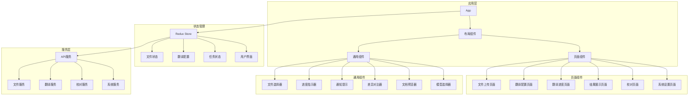
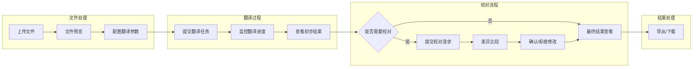
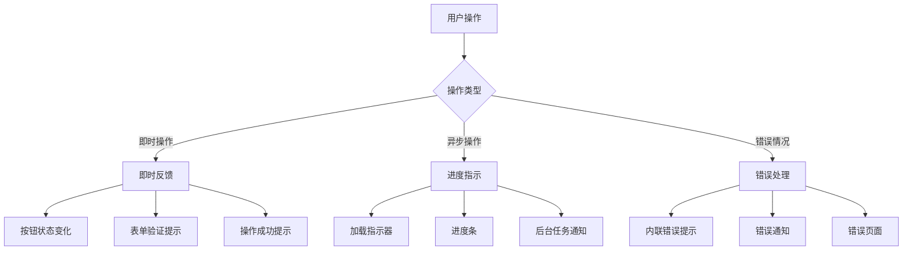

# 前端架构设计

*本文档描述专利文档翻译系统的前端架构设计。*

## 目的与范围

本文档详细描述专利文档翻译系统的前端架构设计，包括界面组件、状态管理、交互流程以及与后端系统的集成方式。本设计文档主要面向前端开发人员、UI/UX设计师以及项目管理者，作为前端实现和后续迭代的参考依据。

主要内容包括：
- 前端技术栈选型与组件架构
- 页面布局与响应式设计策略
- 状态管理与数据流转
- 用户交互流程
- 前后端通信机制
- 错误处理与用户反馈
- 性能优化考虑

## 架构原则

1. **用户体验优先** - 提供直观、高效的操作流程，减少用户学习曲线
2. **响应式设计** - 适配不同屏幕尺寸，保证在各种设备上的可用性
3. **组件化开发** - 通过可复用组件构建界面，提高开发效率和维护性
4. **状态集中管理** - 采用集中式状态管理，简化组件间通信
5. **离线优先** - 所有功能设计考虑离线使用场景，减少外部依赖
6. **渐进增强** - 核心功能优先实现，后续迭代添加高级特性
7. **可访问性设计** - 考虑不同用户需求，确保界面的可访问性
8. **一致性设计** - 维持视觉和交互的一致性，降低用户认知负担

## 技术栈

### 核心框架与库

- **前端框架**: React 18
  - 组件化开发模式
  - 虚拟DOM高效渲染
  - 广泛的社区支持和丰富的生态系统

- **UI组件库**: Ant Design 5.x
  - 专业设计的企业级UI组件库
  - 丰富的表单、表格、模态框等组件
  - 支持自定义主题和国际化

- **状态管理**: Redux Toolkit
  - 集中式状态管理
  - 内置不可变性处理
  - 简化的异步逻辑处理(createAsyncThunk)

- **路由管理**: React Router 6
  - 声明式路由定义
  - 嵌套路由支持
  - 路由级代码分割

### 构建与开发工具

- **构建工具**: Vite
  - 快速的开发服务器启动
  - 高效的HMR（热模块替换）
  - 优化的生产构建

- **CSS处理**: SASS/SCSS + CSS Modules
  - 模块化CSS，避免全局样式冲突
  - 预处理器支持变量、混合等高级特性
  - 与组件结构对应的样式组织

- **TypeScript**
  - 静态类型检查
  - 改进的开发体验和自动完成
  - 代码可维护性提升

### 实用工具库

- **HTTP请求**: Axios
  - 请求拦截器和响应拦截器
  - 请求取消支持
  - 自动转换JSON数据

- **日期处理**: Day.js
  - 轻量级日期库
  - 丰富的格式化和解析功能

- **表单处理**: React Hook Form
  - 性能优化的表单处理
  - 简化的表单验证

- **文件处理**: FileSaver.js/JSZip
  - 客户端文件保存
  - ZIP文件生成与处理

- **数据可视化**: Recharts
  - 基于React的图表库
  - 响应式设计
  - 自定义组件支持

- **差异比较**: diff
  - 文本差异显示
  - 校对结果对比

## 组件结构与层次关系



### 组件层次说明

#### 1. 应用层

- **App**: 应用程序入口，包含全局配置和路由定义
- **布局组件**: 提供页面框架结构，包括顶部导航、侧边栏等

#### 2. 页面组件

- **文件上传页面**: 处理文件上传、格式验证和文件预览
- **翻译配置页面**: 提供翻译参数设置、语言选择、模型选择等
- **翻译进度页面**: 显示翻译任务进度、状态和预估完成时间
- **结果展示页面**: 展示翻译结果，提供预览和导出选项
- **校对页面**: 差异比较和校对建议确认界面
- **系统设置页面**: 全局配置和系统参数设置

#### 3. 通用组件

- **文件选择器**: 处理文件拖放和选择上传
- **进度指示器**: 进度条和状态显示组件
- **通知提示**: 系统提示和错误信息展示
- **差异对比器**: 对比原翻译和校对建议
- **文档预览器**: 预览各种格式的文档
- **模型选择器**: 选择翻译和校对模型

#### 4. 状态管理层

- **文件状态**: 上传文件信息、处理状态等
- **翻译配置**: 语言选择、参数设置、模型选择等
- **任务状态**: 翻译和校对任务的进度和状态信息
- **用户界面**: UI相关状态，如主题设置、布局配置等

#### 5. 服务层

- **文件服务**: 文件上传、下载、格式转换相关API
- **翻译服务**: 翻译任务提交、查询和控制
- **校对服务**: 校对请求处理和结果获取
- **系统服务**: 系统配置和状态信息获取

## 状态管理策略

### Redux状态结构

```
store
├── files/              # 文件相关状态
│   ├── uploadedFiles   # 已上传文件列表
│   ├── currentFile     # 当前处理的文件
│   ├── fileHistory     # 历史文件记录
│   └── uploadStatus    # 上传状态信息
│
├── translation/        # 翻译相关状态
│   ├── config          # 翻译配置参数
│   ├── sourceLanguage  # 源语言
│   ├── targetLanguage  # 目标语言
│   ├── model           # 选择的模型
│   ├── chunkSize       # 分块大小设置
│   └── tasks           # 翻译任务列表
│
├── review/             # 校对相关状态
│   ├── reviewModel     # 校对模型
│   ├── diffResults     # 差异比较结果
│   ├── acceptedChanges # 已接受的修改
│   └── rejectedChanges # 已拒绝的修改
│
├── ui/                 # 界面相关状态
│   ├── theme           # 主题设置
│   ├── sidebarOpen     # 侧边栏状态
│   ├── activeView      # 当前活动视图
│   ├── notifications   # 通知消息队列
│   └── modalState      # 模态框状态
│
└── system/             # 系统相关状态
    ├── availableModels # 可用模型列表
    ├── systemStatus    # 系统状态信息
    ├── resourceUsage   # 资源使用情况
    └── configuration   # 系统配置
```

### 状态管理策略

1. **状态隔离**
   - 将应用状态分为多个域，每个域负责特定类型的数据
   - 通过Redux的slice机制实现状态隔离
   - 减少状态变更的副作用范围

2. **异步处理**
   - 使用Redux Toolkit的createAsyncThunk处理API请求
   - 统一处理加载状态、成功和错误状态
   - 请求取消和超时处理

3. **持久化策略**
   - 关键配置使用localStorage持久化
   - 会话状态使用sessionStorage保存
   - 使用redux-persist实现选择性状态持久化

4. **状态更新规则**
   - 不可变更新模式，使用Redux Toolkit的immer支持
   - 最小状态更新原则，仅更新必要的部分
   - 批量状态更新优化性能

## 用户交互流程



### 主要用户流程说明

#### 1. 文件上传与预处理

- 用户通过拖放或文件选择器上传文件
- 系统验证文件格式并提取文本内容
- 显示文件内容预览，确认可处理
- 用户可在此阶段取消或继续

#### 2. 翻译配置

- 选择源语言和目标语言
- 选择翻译模型（根据可用模型列表）
- 配置高级参数（chunk大小、术语库等）
- 提交翻译任务

#### 3. 翻译过程监控

- 实时显示整体任务进度
- 显示当前处理的块和预估完成时间
- 提供暂停/继续和取消选项
- 支持后台处理，允许用户执行其他操作

#### 4. 校对流程（可选）

- 用户查看初步翻译结果
- 决定是否需要校对
- 如需校对，配置校对模型和参数
- 系统生成校对建议和差异比较
- 用户逐条或批量确认/拒绝修改

#### 5. 结果处理

- 显示最终翻译结果
- 提供源文与译文的对比视图
- 选择输出格式（Markdown/Word）
- 下载结果文件

## 布局与响应式设计原则

### 布局策略

1. **网格系统**
   - 采用24列栅格系统（Ant Design默认）
   - 适应不同屏幕尺寸的灵活布局
   - 合理的边距和间距规范

2. **布局结构**
   - 侧边栏导航+主内容区域的经典布局
   - 功能区块明确分隔
   - 关键操作区域保持固定视图

3. **组件布局**
   - 按照操作流程组织界面元素
   - 相关功能分组显示
   - 主次分明的视觉层次

### 响应式设计断点

| 断点名称 | 宽度范围     | 典型设备           | 布局调整策略                 |
|----------|--------------|--------------------|--------------------------|
| XS       | < 576px      | 手机               | 单列布局，堆叠组件          |
| SM       | ≥ 576px      | 平板（纵向）      | 侧边栏收起，主要功能优先    |
| MD       | ≥ 768px      | 平板（横向）      | 双列布局，部分功能收起      |
| LG       | ≥ 992px      | 笔记本            | 完整布局，优化可视区域      |
| XL       | ≥ 1200px     | 台式显示器        | 最佳布局，全功能展示        |
| XXL      | ≥ 1600px     | 大屏显示器        | 增强内容展示，多面板并列    |

### 响应式设计策略

1. **移动优先**
   - 从最小屏幕开始设计，逐步增强
   - 关键功能在任何屏幕尺寸都可用

2. **弹性布局**
   - 基于百分比的宽度而非固定像素
   - 使用flex布局实现灵活的内容排列
   - 使用Grid布局处理复杂的二维布局

3. **媒体查询优化**
   - 特定断点的样式调整
   - 组件适应性显示/隐藏
   - 内容密度调整

4. **触控友好**
   - 适当的触控目标大小（至少44×44px）
   - 清晰的视觉反馈
   - 考虑手势操作

## 性能优化策略

### 初始加载优化

1. **代码分割**
   - 基于路由的代码分割
   - 组件级别的动态导入
   - 核心功能优先加载

2. **资源优化**
   - 静态资源压缩
   - 图片懒加载
   - 关键CSS内联

3. **预加载策略**
   - 关键路径资源预加载
   - 用户交互预测的资源提前加载
   - 空闲时间的数据预取

### 运行时优化

1. **渲染性能**
   - 使用React.memo避免不必要的重渲染
   - 优化useEffect依赖
   - 虚拟列表用于大数据集展示

2. **状态管理优化**
   - 选择性的组件连接到Redux
   - 状态正规化减少冗余数据
   - 批量状态更新

3. **网络请求优化**
   - 请求合并和批处理
   - 数据缓存策略
   - 乐观UI更新提升响应感知

### 用户体验优化

1. **骨架屏**
   - 内容加载中显示布局骨架
   - 减少用户等待感知

2. **增量渲染**
   - 复杂页面组件分批渲染
   - 优先渲染可视区域内容

3. **后台处理**
   - 耗时操作放入Web Worker
   - 翻译任务后台处理，不阻塞UI

## 错误处理与用户反馈设计

### 错误处理策略

1. **前端错误分类**
   - 用户输入错误 - 表单验证和即时反馈
   - 系统错误 - 技术和环境相关问题
   - 网络错误 - API请求失败和超时

2. **错误捕获机制**
   - 全局错误边界（Error Boundaries）
   - 异步错误处理中间件
   - try/catch与错误日志

3. **错误恢复策略**
   - 自动重试机制（带指数退避）
   - 降级展示和功能
   - 清晰的恢复路径指导

### 用户反馈设计

1. **通知系统**
   - 消息类型：信息、成功、警告、错误
   - 位置：顶部居中（重要消息）、右上角（一般通知）
   - 持续时间：基于消息类型和内容长度

2. **操作反馈**
   - 即时视觉反馈（按钮状态、动画）
   - 进度指示（确定性进度条和不确定性加载器）
   - 操作结果确认

3. **交互指导**
   - 上下文相关的帮助提示
   - 引导式操作流程
   - 空状态和错误状态的建议行动

### 反馈界面组件



## 前后端通信机制

### API通信设计

1. **请求封装**
   - 基于Axios的API客户端
   - 请求/响应拦截器
   - 统一的错误处理和序列化

2. **API请求模式**
   - RESTful API设计
   - 长任务采用轮询或WebSocket
   - 状态同步采用可恢复的事务

3. **API安全与稳定性**
   - 请求超时和重试策略
   - 请求队列管理
   - 幂等性设计防止重复操作

### 实时通信

1. **WebSocket通信**
   - 翻译进度的实时更新
   - 系统状态监控
   - 断线重连机制

2. **消息格式**
   - 统一的消息结构
   - 类型化的消息体
   - 版本控制支持

## 关键决策与权衡考虑

### 1. 前端框架选择

**决策**: 使用React和Ant Design

**理由**:
- React的组件模型适合复杂UI的构建
- Ant Design提供丰富的企业级组件
- 开发团队已有相关技术栈经验

**权衡**:
- Vue可能有更低的学习曲线
- 定制Ant Design组件可能需要额外工作
- React生态系统复杂度增加了维护成本

### 2. 状态管理方案

**决策**: 使用Redux Toolkit

**理由**:
- 集中管理复杂应用状态
- 内置不可变数据处理和异步逻辑
- 提供开发者工具便于调试

**权衡**:
- 对于简单组件，Context API可能更轻量
- Redux的样板代码量较大
- 学习曲线较陡峭

### 3. 构建工具选择

**决策**: 使用Vite而非Create React App

**理由**:
- 极快的开发服务器启动时间
- ESM原生模块支持
- 优化的生产构建

**权衡**:
- Create React App生态更成熟
- 可能需要额外配置某些工具兼容性
- 需要团队学习新工具链

### 4. 离线优先实现

**决策**: 本地化数据处理配合状态持久化

**理由**:
- 符合系统离线处理的安全要求
- 减少对服务器的依赖
- 提升用户体验连续性

**权衡**:
- 增加前端数据处理复杂度
- 状态同步与冲突解决更复杂
- 可能需要大量本地存储

## 风险与缓解策略

### 1. 大文件处理性能风险

**风险**: 在浏览器中处理大型文档可能导致性能问题

**缓解策略**:
- 实现数据虚拟化和分页加载
- 采用Web Worker进行后台处理
- 设置文件大小限制和分块处理
- 优化DOM操作和渲染策略

### 2. 浏览器兼容性风险

**风险**: 现代Web API在某些浏览器中不支持

**缓解策略**:
- 明确支持的浏览器版本（Chrome最新版，Firefox，Safari）
- 使用polyfill和渐进增强
- 在关键功能点添加浏览器兼容性检测
- 提供功能降级方案

### 3. 用户体验连续性风险

**风险**: 长时间任务中断导致工作丢失

**缓解策略**:
- 实现会话状态持久化
- 自动保存功能和断点恢复
- 操作历史记录和回滚能力
- 清晰的错误恢复指导

### 4. 前后端通信风险

**风险**: API通信失败或数据不一致

**缓解策略**:
- 实现请求重试和降级策略
- 客户端数据验证和错误处理
- 乐观UI更新与悲观回滚
- 完善的同步状态机制

## 未来扩展考虑

### 1. 国际化支持

- 多语言界面（使用i18next或类似框架）
- 本地化日期、数字和文本格式
- RTL布局支持

### 2. 增强可访问性

- WCAG 2.1标准合规
- 键盘导航优化
- 屏幕阅读器支持
- 高对比度主题

### 3. 高级交互功能

- 高级文档比较视图
- 交互式术语管理
- 自定义翻译记忆库
- 批处理工作流

### 4. 离线增强

- 完整的PWA支持
- 高级本地缓存策略
- 后台同步能力
- 离线翻译队列
