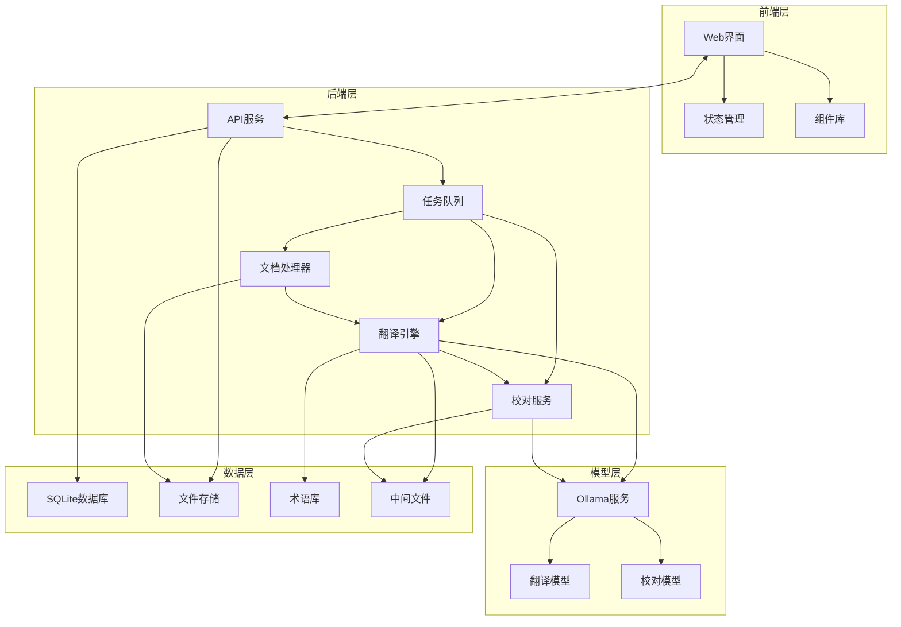

# 集成架构设计

*本文档描述专利文档翻译系统的集成架构设计。*

## 目的与范围

本文档定义了专利文档翻译系统中各组件之间的集成架构和交互方式，以确保系统的无缝协作和高效运行。文档面向系统架构师、集成工程师和开发团队，提供系统的全视图和各组件的协作方式。

主要内容包括：
- 系统组件的逻辑分层与交互关系
- 组件间的通信机制与数据交换格式
- 集成测试策略与验证方法
- 错误处理与故障恢复机制
- 系统集成中的性能和安全考量

## 系统组件集成概览

专利文档翻译系统采用多层架构，包括前端层、后端层和模型层。各层组件通过定义的接口进行交互，实现松耦合的集成架构。



### 主要组件说明

#### 1. 前端层

- **Web界面**：基于React的用户界面，提供文件上传、翻译配置、进度监控和结果展示功能
- **状态管理**：使用Redux Toolkit管理应用状态，处理前端数据流
- **组件库**：Ant Design提供的UI组件集

#### 2. 后端层

- **API服务**：基于FastAPI的REST API，处理前端请求
- **任务队列**：使用Celery管理长时间运行的翻译和校对任务
- **文档处理器**：负责解析和转换不同格式的文档
- **翻译引擎**：管理翻译过程，与大语言模型交互
- **校对服务**：处理翻译结果的审校和优化

#### 3. 模型层

- **Ollama服务**：本地部署的大语言模型服务
- **翻译模型**：用于文档翻译的大语言模型（deepseek-r1:14b等）
- **校对模型**：用于翻译结果校对的大语言模型（deepseek-r1:8b等）

#### 4. 数据层

- **SQLite数据库**：存储任务、文档和用户数据
- **文件存储**：本地文件系统上的文档存储
- **术语库**：专业术语的存储和管理
- **中间文件**：存储翻译和校对过程的中间数据

## 组件间通信机制

系统组件间采用不同的通信机制，以适应不同的交互需求。

### 1. 前后端通信

**REST API 通信**

前端与后端之间主要通过RESTful API进行通信：

- **请求方式**：标准HTTP方法（GET/POST/PUT/DELETE）
- **身份验证**：可选的基本身份验证（本地系统，低安全需求）
- **数据格式**：JSON请求/响应体
- **错误处理**：标准HTTP状态码和错误响应结构

**WebSocket 实时通信**

用于实时更新翻译和校对进度：

- **连接管理**：由FastAPI与WebSockets支持
- **消息格式**：结构化JSON消息
- **更新类型**：进度更新、状态变化、错误通知

### 2. 后端内部通信

**任务队列通信**

后端服务之间通过Celery任务队列进行通信：

- **队列机制**：使用内存队列（开发环境）或Redis/RabbitMQ（可选）
- **任务调度**：异步任务处理与结果回调
- **事件通知**：基于任务状态的事件触发

**数据库交互**

组件与数据层的交互：

- **ORM层**：使用SQLAlchemy进行数据库操作
- **连接池**：管理数据库连接
- **事务管理**：确保数据一致性

### 3. 与模型层通信

**Ollama API集成**

翻译引擎和校对服务与Ollama的通信：

- **API封装**：基于LangChain的Ollama集成
- **请求格式**：HTTP POST请求与JSON载荷
- **模型参数**：可配置的生成参数（temperature、top_p等）
- **错误处理**：超时和失败重试机制

## 数据交换格式

系统各组件间采用标准化的数据交换格式，确保一致性和兼容性。

### 1. API数据格式

**REST API 请求/响应格式**

```json
// 请求示例 - 创建翻译任务
{
  "file_id": "f47ac10b-58cc-4372-a567-0e02b2c3d479",
  "source_language": "zh",
  "target_language": "en",
  "model_id": "deepseek-r1:14b",
  "chunk_size": 1000,
  "terminology_id": "lib-001"
}

// 响应示例 - 成功创建任务
{
  "success": true,
  "message": "翻译任务创建成功",
  "data": {
    "task_id": "e47ac10b-58cc-4372-a567-0e02b2c3d123",
    "status": "queued",
    "created_at": "2025-03-05T12:05:00Z",
    "estimated_completion_time": "2025-03-05T12:15:00Z"
  }
}

// 错误响应示例
{
  "success": false,
  "message": "请求处理失败",
  "error_code": "FILE_NOT_FOUND",
  "details": "指定的文件ID不存在"
}
```

**WebSocket 消息格式**

```json
// 进度更新消息
{
  "type": "progress_update",
  "task_id": "e47ac10b-58cc-4372-a567-0e02b2c3d123",
  "progress": 45.5,
  "current_chunk": 9,
  "total_chunks": 20,
  "remaining_time": 300,
  "timestamp": "2025-03-05T12:10:00Z"
}

// 状态变化消息
{
  "type": "status_change",
  "task_id": "e47ac10b-58cc-4372-a567-0e02b2c3d123",
  "old_status": "processing",
  "new_status": "completed",
  "timestamp": "2025-03-05T12:15:00Z"
}
```

### 2. 文件格式

**支持的输入格式**
- Markdown (.md)
- Microsoft Word (.docx)
- 纯文本 (.txt)

**支持的输出格式**
- Markdown (.md)
- Microsoft Word (.docx)

**中间文件格式**

Markdown兼容的块结构，包含源文本和译文的对应关系：

```markdown
<!-- chunk:start id="001" source="en" target="zh" model="deepseek-r1-14b" time="2025-03-05T10:15:00Z" -->
## 源文本
This is the original text in English.

## 译文
这是翻译成中文的文本。
<!-- chunk:end id="001" -->
```

### 3. 模型交互格式

**Ollama API请求格式**

```json
{
  "model": "deepseek-r1:14b",
  "prompt": "<提示词模板>",
  "system": "<系统提示>",
  "stream": false,
  "options": {
    "temperature": 0.3,
    "top_p": 0.9,
    "max_tokens": 2000
  }
}
```

**提示词模板结构**

```
<系统指令>
你是一个专业的<源语言>到<目标语言>翻译专家，特别擅长专利文档的翻译。请将以下文本翻译为<目标语言>，保持原文的专业术语、格式和语气。

<术语参考>
<对译语对列表>

<辅助上下文>

<源文本>
```

## 集成测试策略

为确保系统组件正确集成，需要采用系统的集成测试策略。

### 1. 集成测试级别

**组件间集成测试**
- 测试前端与后端API的交互
- 测试后端服务与数据库的集成
- 测试翻译引擎与Ollama模型的交互

**端到端测试**
- 测试完整的翻译流程（上传-翻译-校对-下载）
- 模拟实际用户场景和操作

**负载测试**
- 测试系统在高并发条件下的性能
- 评估系统组件的资源使用情况

### 2. 测试工具与方法

**自动化API测试**
- 使用Pytest和请求模拟
- API接口处理的单元测试和集成测试

**模拟服务**
- Mock Ollama服务响应以测试翻译引擎
- 模拟数据库和文件系统交互

**容器化测试环境**
- 使用Docker创建一致的测试环境
- 模拟完整的部署环境

### 3. 测试数据集

**基准测试文档**
- 不同语言对的标准专利样本
- 包含复杂格式和专业术语的测试文档

**性能基准**
- 大小不同的文档测试集
- 并发任务的测试数据

## 性能考量

系统集成中需要特别关注的性能因素。

### 1. 并发与资源管理

**并发控制**
- 基于Mac Mini (M4+16GB)硬件资源设置最大并发任务数
- 动态调整任务队列的并发度
- 防止内存溢出的安全限制

**模型资源优化**
- Ollama模型预热机制
- 模型的内存管理和切换策略
- 根据系统负载动态切换模型大小

### 2. 数据传输优化

**及时响应**
- 使用异步API处理确保界面响应性
- WebSocket提供实时进度更新
- 分块传输和处理大文档

**缓存策略**
- 缓存用户会话和任务状态
- 缓存常用术语和全局配置

### 3. 响应时间优化

**响应时间目标**
- API请求响应时间 < 500ms
- 文件上传处理响应时间 < 2s
- 任务状态查询延迟 < 100ms

**性能监控**
- 关键操作的性能跟踪
- 系统资源使用监控
- 性能瓶颈识别与优化

## 错误处理与故障恢复

系统集成中的错误处理和故障恢复策略。

### 1. 错误处理策略

**错误分类与级别**
- **致命错误**：系统无法继续运行的错误
- **任务错误**：特定任务失败但系统可继续运行
- **可恢复错误**：异常情况可通过重试恢复
- **警告**：非关键问题，需要记录但不中断处理

**错误传播方式**
- API异常响应与状态码
- WebSocket错误通知
- 日志记录与监控警报

### 2. 故障恢复机制

**任务级恢复**
- 自动重试机制（指数退避策略）
- 从最后一个成功的检查点恢复
- 保留部分结果的阶段性恢复

**系统级恢复**
- 组件独立重启机制
- 状态持久化与恢复
- 数据库一致性恢复

**预防措施**
- 健康检查机制（Health Check）
- 系统资源监控与警报
- 定期备份和数据校验

## 关键决策与权衡考虑

集成架构设计中的关键决策。

### 1. 本地Ollama模型与网络集成

**决策**：使用本地部署的Ollama模型，而非云API

**理由**：
- 满足离线运行的安全需求
- 避免专利文档发送至第三方服务器
- 降低长期运营成本

**权衡**：
- 在性能和翻译质量上可能不如大型云服务模型
- 需要更高的本地计算和存储资源
- 模型更新和维护需要手动处理

### 2. FastAPI与Celery的集成

**决策**：使用FastAPI作为Web框架，Celery作为任务队列

**理由**：
- FastAPI提供高性能异步API支持
- Celery提供成熟的任务队列和调度功能
- 两者结合实现API响应和长时任务的隔离

**权衡**：
- 增加了系统复杂性
- 需要额外的依赖管理
- Celery配置和监控的额外工作

### 3. 中间文件格式设计

**决策**：使用基于Markdown的中间文件格式

**理由**：
- 保存源文本和译文的精确对应关系
- 便于人工查阅和编辑
- 与文本格式共享转换工具

**权衡**：
- 文本标记可能增加处理复杂性
- 需要额外的解析工具
- 基于HTML注释的格式依赖于正确匹配

## 风险与缓解策略

系统集成过程中需要特别关注的风险。

### 1. 组件兼容性风险

**风险**：各组件版本变化可能导致兼容性问题

**缓解策略**：
- 依赖项版本的精确锁定
- 全面的集成测试覆盖
- 版本更新的迁移测试

### 2. 模型性能风险

**风险**：本地部署的模型性能受硬件限制

**缓解策略**：
- 自动化模型预热机制
- 根据文档复杂性动态选择模型大小
- 最小化上下文切换

### 3. 数据一致性风险

**风险**：各组件间的数据状态可能不一致

**缓解策略**：
- 集中化的任务状态管理
- 定期状态同步和校验
- 事务一致性保证

### 4. 系统崩溃风险

**风险**：处理大量并发任务可能导致系统崩溃

**缓解策略**：
- 资源限制和负载平衡
- 任务的隔离和连锁保护
- 健康监控和自动恢复

## 未来扩展考虑

系统集成架构的未来可能的扩展方向。

### 1. 模型扩展

- **多模型支持**：集成更多类型的模型，用于不同需求
- **模型微调**：添加基于专利文档的适应性模型微调
- **模型量化**：使用模型量化技术提高性能

### 2. 分布式部署

- **多节点部署**：支持系统组件在多台设备上分布式部署
- **负载均衡**：在多个模型服务实例之间分配任务
- **容器化部署**：使用Docker容器简化部署和扩展

### 3. 用户体验增强

- **翻译记忆库**：添加翻译记忆库提高翻译效率和一致性
- **协作编辑**：允许多用户协作编辑和审核翻译
- **多平台支持**：扩展到移动平台或桌面应用

### 4. API扩展

- **版本控制API**：添加API版本控制，确保向后兼容性
- **GraphQL支持**：提供更灵活的数据查询能力
- **第三方集成**：支持与其他系统和服务的集成
